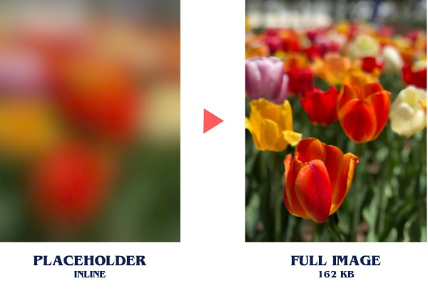

![lightspeed-image-loader latest version][version]
![Dependencies status][status]
![devDependencies status][status-dev]

# Lightspeed Image Loader


On-the-fly responsive image resizing and minification for webpack v4. Uses
[mozjpeg][mozjpeg], [Gifsicle][gifsicle], [OptiPNG][optipng], and
[SVGO][svgo], supports [WebP][webp], and can even generate Medium.com-style
low-quality image placeholders (LQIP) for loading.

### Support

| Filetype | Resizing | Optimization | Converting to |
| :------- | :------: | :----------: | :-----------: |
| JPG      | ✅        | ✅            | ✅             |
| PNG      | ✅        | ⚠️ **SLOW**  | ⚠️ **SLOW**   |
| WebP     | ✅        | ✅            | ✅             |
| SVG      | N/A      | ✅            | N/A           |
| GIF      | 🚫       | ✅            | 🚫            |

_Note: GIF resizing/conversion isn’t supported due to lack of support in
[sharp][sharp]. Overall, it’s a small price to pay for the build speed of the
sharp library._

## Installation

```
npm i --save-dev lightspeed-image-loader
```

## Usage

### Simple usage

In your **[production webpack config][webpack-prod],** add the following:

```js
module: {
  rules: [
    {
      test: /\.(jpe?g|gif|png|svg)/i,
      use: 'lightspeed-image-loader'
    }
  ],
},
```

Then from your app, import image files normally. Specify specific
optimizations per each file:

```js
import imgSmall from './img/background-full.jpg?w=600&q=75'; /* 600px wide, 75% quality */
import imgLarge from './img/background-full.jpg?w=1200&q=50'; /* 1200px wide, 50% quality */
```

#### React

```jsx

```

#### Vue

```vue

```

#### Styled Components

```js
const Header = styled.header`
  background-image: ${imgSmall};

  @media (min-width: 600px) {
    background-image: ${imgLarge};
  }
`;
```

### Examples

#### Responsive (React)

```js
import small from './myimage.jpg?w=600&q=80';
import medium from './myimage.jpg?w=1200&q=75';
import large from './myimage.jpg?w=1800&q=65';

..


```

#### WebP (React)

```js
import webP from './myimage.jpg?f=webp';
import fallback from './myimage.jpg';

...

<picture>
  <source srcset={webP} type="image/webp" />
  <source srcset={fallback} type="image/jpeg" />
  
</picture>
```

#### Base64 inlined image (Styled Components)

```js
import inlineBg from './myimage.jpg?inline';

...

const Wrapper = styled.div`
  background-image: url(${inlineBg});
`;
```

#### Inline SVG (React)

```js
import inlineSVG from './myimage.svg?inline';

...

<div dangerouslySetInnerHtml={{ __html: inlineSVG }} />
```

#### Resizing pixel art

```js
import pixelArt from './pixel-art?w=2048&interpolation=nearest';
```

#### Low Quality Image Placeholder (LQIP) (React)

<p align="center">
  
</p>

```js
import image from './myimage.jpg?w=1200';
import placeholder from './myimage.jpg?placeholder';

<div style={{ backgroundImage: `url("${placeholder}"), backgroundSize: 'cover'` }}>
  
</div>;
```

_Note: double quotes inside `url("")` are important! [Why?](#lqip-placeholder-images-are-blank)_

Low quality image placeholders (LQIP) improve user experience by letting
users look at something while an image loads ([more info in this
article][lqip-article]).

The LQIP will be small by default, but it will preserve its aspect ratio.
Either use `width: 100%; height: auto` to fill the area, or `background-size`
to make it larger.

This loader generates SVG LQIP to avoid that white fuzzy border caused by
CSS’ blur filter on normal images.

Placeholders can’t be generated for SVGs.

## Options

Specifying options per-image is the preferred method of this loader. By
setting options per-file, you can fine-tune each image to find the best
balance of quality and compression. Plus, you don’t have to touch your
webpack config as your images change.

### Query Options

| Name            | Default      | Description                                                                                                                                                                        |
| :-------------- | :----------- | :--------------------------------------------------------------------------------------------------------------------------------------------------------------------------------- |
| `width`         | (original)   | Set image width (in pixels). Leave `height` blank to auto-scale. Specify `width` and `height` to ensure image is smaller than both.                                                |
| `w`             |              | Shortcut for `width`.                                                                                                                                                              |
| `height`        | (original)   | Scale image height (in pixels). Leave `width` blank to auto-scale. Specify `width` and `height` to ensure image is smaller than both.                                              |
| `h`             |              | Shortcut for `height`.                                                                                                                                                             |
| `quality`       | `70`         | Specify `1`–`100` to set the image’s quality<sup>\*</sup>. For each image, set it as low as possible before compression is noticeable at display size.                            |
| `q`             |              | Shortcut for `quality`.                                                                                                                                                            |
| `interpolation` | `'lanczos3'` | When scaling, specify `'nearest'` for nearest-neighbor (pixel art), `'cubic'` for cubic interpolation, or `'lanczos2'` or `'lanczos3'` for [Lanczos][lanczos] with `a=2` or `a=3`. |
| `inline`        | `false`      | Set to `?inline` or `?inline=true` to return the individual image in base64 data URI, or raw SVG code 🎉.                                                                          |
| `format`        | (same)       | Specify `jpg`, `webp`, or `png` to convert format from the original.                                                                                                               |
| `f`             |              | Shortcut for `format`.                                                                                                                                                             |
| `placeholder`   | `false`      | Specify `?placeholder` to return a low-quality image placeholder (technically this can be used alongside other options, but it’s not advised).                                    |
| `skip`          | `false`      | Set to `?skip` to bypass resizing & optimization entirely. This is particularly useful for SVGs that don’t optimize well.                                                         |

_<sup>\*</sup> Note: GIFsicle and OptiPNG don’t use a 1–100 quality scale, so
`quality` will convert for you. However, if using loader options below, you’ll
need to specify the proper options there._

#### Example

```js
import myImage from './large.jpg?q=50&w=1200&f=webp'; // Convert to WebP, 50% quality, and 1200px wide
```

_Note: this loader **will not** upscale images because it increases file size
without improving image quality. If you need to upscale pixel art, do it in
CSS with `image-rendering: crisp-edges`._

### Loader options

The main advantage of this loader is being able to specify quality and width
inline, but there are some settings which make sense to set globally, such as
[SVGO][svgo] settings, or a fallback quality. In these cases, pass options to
the loader as usual:

| Name         | Default             | Description                                                                                         |
| :----------- | :------------------ | :-------------------------------------------------------------------------------------------------- |
| `outputPath` | `output.path`       | Override webpack’s default output path for these images (setting from [file-loader][file-loader]). |
| `publicPath` | `output.publicPath` | Override webpack’s default output path for these images (setting from [file-loader][file-loader]). |
| `emitFile`   | `true`              | Set to `false` to skip processing file (setting from [file-loader][file-loader]).                   |
| `gifsicle`   | (object)            | Specify Gifsicle options ([view options][gifsicle-options]).                                        |
| `mozjpeg`    | (object)            | Specify mozjpeg options ([view options][mozjpeg-options]).                                          |
| `optipng`    | (object)            | Specify OptiPNG options ([view options][optipng-options]).                                          |
| `pngquant`   | (object)            | Specify PNGquant options ([view options][pngquant-options]).                                        |
| `svgo`       | (object)            | Specify [SVGO][svgo] options.                                                                       |

_Note: because this loader passes images on to [file-loader][file-loader],
you should be able to use any of its options within this config. However,
**don’t use this loader for anything other than images!**_

#### Example

```js
module: {
  rules: [
    {
      test: /(jpe?g|gif|png|svg)$/i,
      use: {
        loader: 'lightspeed-image-loader',
        options: {
          mozjpeg: {
            quality: 60, // 1 – 100, higher is heavier
          },
          optipng: {
            optimizationLevel: 5, // 0 = light; 7 = heavy compression
          },
          svgo: {
            addClassesToSVGElement: true,
            mergePaths: true,
            removeStyleElement: true,
          },
          webp: {
            quality: 80,
          },
        },
      },
    },
  ],
},
```

## WebP

Because WebP currently is only supported by Chrome, you’ll still need to
configure fallbacks. For that reason, you can only convert per-file:

```js
import webP from './original.jpg?f=webp';
import fallback from './original.jpg';
```

For tips on using WebP effectively, read this [CSS Tricks article][csstricks].

## Troubleshooting

### Python Version

If `python --version` returns ^3 on your system, you’ll likely encounter the
[frequently-discussed node-gyp][node-gyp] error:

```
Error: Python executable \"/usr/local/bin/python\" is v3.x.x, which is not supported by gyp.
```

If `which python2.7` works on your system, run
`npm config set python python2.7` (or `yarn config set python python2.7` if
using yarn).

If your machine doesn’t have `python2.7`, install Python 2.x using
[Homebrew][homebrew] or some other means, and set that executable with
`npm config set python /path/to/python2` or
`yarn config set python /path/to/python2`

### LQIP (placeholder images) are blank

The placeholder SVGs are compressed further by
[mini-svg-data-uri][mini-svg-data-uri], which requires **double quotes** for
`` and `background-image: url("[placeholder]")`.
Check to make sure your code is outputting double quotes in HTML/CSS.

The tradeoff for having to always use double quotes is much smaller bundles,
and better GZIP performance without sacrificing browser support.
[@tigt][@tigt] wrote a [great blog post on the subject][svg-base64-article]

## FAQ

### Why do I have to use one `import` per size?

There are several advantages to this method:

* **Control**: You can declare options per-size, and fix issues where a particular image size requires different settings.
* **Speed**: Specifying options per-file keeps the loader fast by only applying operations you specify (e.g., a placeholder image isn’t needlessly generated if you don’t specify one—this can severely slow down build times with many images)
* **Simplicity**: There’s no syntax to memorize; one reference = one image URL or data-URI

### Why doesn’t this loader chain nicely with others?

Two reasons: first, image optimization / resizing has a particular order that
needs to be kept: resizing first, then optimization. Always. If there’s only
one proper order for images, and if one loader does it all, why chain?

Second, and more importantly, webpack doesn’t make it easy to serve a single
file extension in multiple ways. This makes it difficult to reformat one
image type into another as well as apply different compression rules
per-file. In order to accomplish this, this loader breaks chaining in order
to do what makes the most sense for image workflows (and if something is
missing, please [file an issue][issues]!).

## Special Thanks

This loader wouldn’t be possible without the significant achievements of:

* [@dcommander][@dcommander] for [mozjpeg][mozjpeg]
* [@kornelski][@kornelski] for [pngquant][pngquant]
* [@kevva][@kevva] for [imagemin][imagemin]
* [@sokra][@sokra], [@d3viant0ne][@d3viant0ne], and [@michael-ciniawsky][@michael-ciniawsky] for [file-loader][file-loader]
* [@lovell][@lovell] for [sharp][sharp]
* [@tigt][@tigt] for [mini-svg-data-uri][mini-svg-data-uri]

[@dcommander]: https://github.com/dcommander
[@d3viant0ne]: https://github.com/d3viant0ne
[@kevva]: https://github.com/kevva
[@kornelski]: https://github.com/kornelski
[@lovell]: https://github.com/lovell
[@michael-ciniawsky]: https://github.com/michael-ciniawsky
[@sokra]: https://github.com/sokra
[@tigt]: https://github.com/tigt
[csstricks]: https://css-tricks.com/using-webp-images/
[mini-svg-data-uri]: https://github.com/tigt/mini-svg-data-uri
[file-loader]: https://github.com/webpack-contrib/file-loader
[gifsicle]: https://github.com/imagemin/imagemin-gifsicle
[gifsicle-options]: https://github.com/dangodev/lightspeed-image-loader/wiki/Gifsicle-Settings
[homebrew]: https://brew.sh/
[imagemin]: https://github.com/imagemin/imagemin
[issues]: https://github.com/dangodev/lightspeed-image-loader/issues
[lanczos]: https://en.wikipedia.org/wiki/Lanczos_resampling
[lqip-article]: https://jmperezperez.com/medium-image-progressive-loading-placeholder/
[mozjpeg]: https://github.com/imagemin/imagemin-mozjpeg
[mozjpeg-options]: https://github.com/dangodev/lightspeed-image-loader/wiki/mozjpeg-Settings
[node-gyp]: https://github.com/nodejs/node-gyp/issues/1337
[optipng]: https://github.com/imagemin/imagemin-optipng
[optipng-options]: https://github.com/dangodev/lightspeed-image-loader/wiki/OptiPNG-Settings
[pngquant]: https://github.com/imagemin/imagemin-pngquant
[pngquant-options]: https://github.com/dangodev/lightspeed-image-loader/wiki/PNGQuant-Settings
[sharp]: https://github.com/lovell/sharp
[status-dev]: https://david-dm.org/dangodev/lightspeed-image-loader/dev-status.svg
[status]: https://david-dm.org/dangodev/lightspeed-image-loader/status.svg
[svg-base64-article]: https://codepen.io/tigt/post/optimizing-svgs-in-data-uris
[svgo]: https://github.com/svg/svgo
[version]: https://badge.fury.io/js/lightspeed-image-loader.svg
[webp]: https://github.com/imagemin/imagemin-webp
[webpack-prod]: https://webpack.js.org/guides/production/
